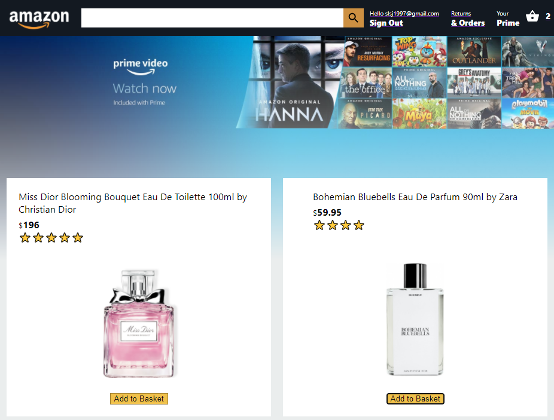
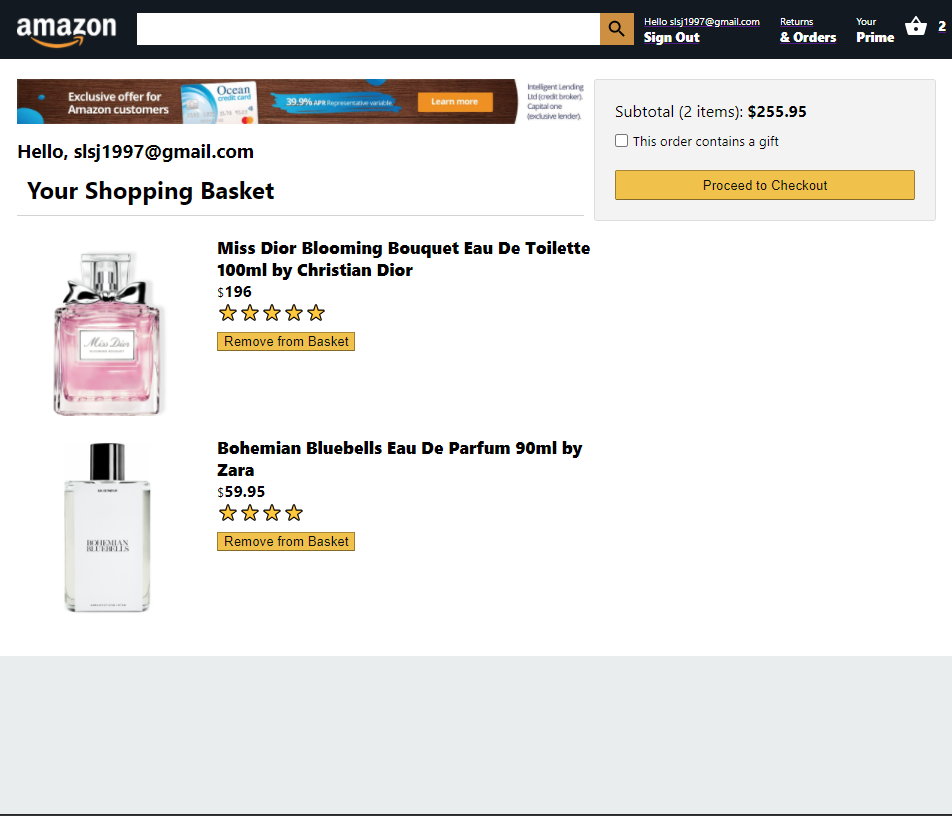
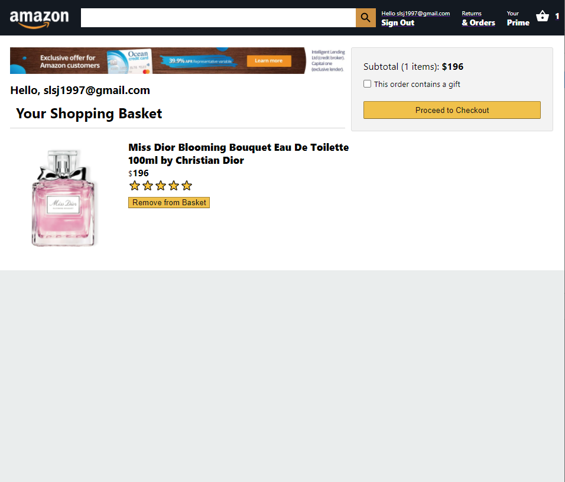
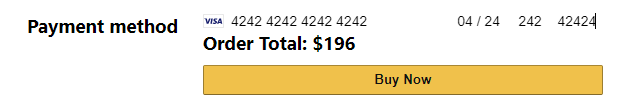
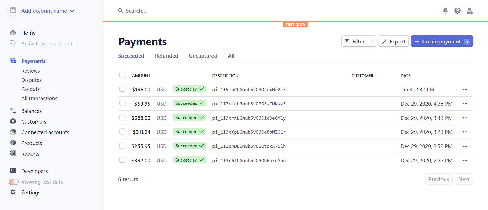
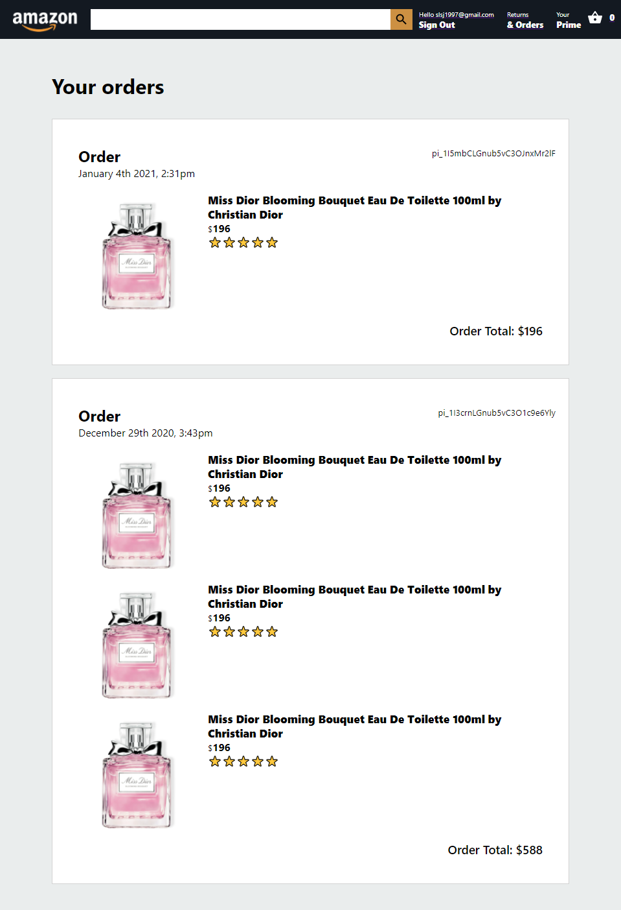
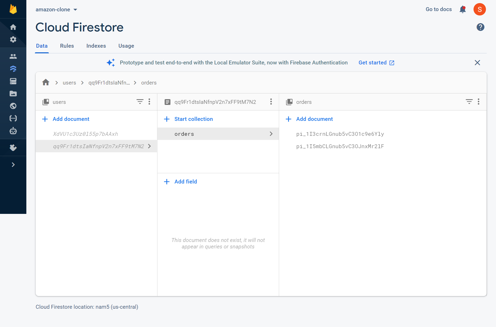

# Project Portfolio
## Project: Amazon Clone
[Amazon Clone](https://clone-124e6.web.app/) is a web application developed using React, with a Google Firebase back-end. This project was developed throughout the winter break in my third year of studies as a computer science undergraduate.

The purpose of this project is to explore full-stack web development, which we are not exposed to during the course of our studies.

You may access the web app [here](https://clone-124e6.web.app/).

Source code can be found [here](https://github.com/shawnlsj97/Amazon-Clone).

## Features Added
### 1. User Authentication
When users first visit Amazon Clone, they can sign up / in via the "Sign In" button on the header.

Users will be redirected to the sign up / in page.

After signing up / in, the header will be updated to reflect that the user is signed in.

User authentication is handled using Firebase.

### 2. Adding Items to Shopping Basket
On the home page, users can add products to their shopping basket by clicking the "Add to Basket" button under each product. The number of items in the shopping basket is indicated in the header (highlighted using the red box).

Users may view their shopping basket by clicking on the shopping basket icon. The total price of items in the shopping basket is displayed on the right.

From this page, users can remove items from their shopping basket by clicking the "Remove from Basket" button. The subtotal is automatically updated whenever an item is removed.

### 3. Checking Out Items
Users can proceed to check out their shopping basket by clicking the "Proceed to Checkout" button.

Users will then be redirected to the Checkout page.

### 4. Making Payment via Stripe
Users can make their payment by entering their credit card details into the payment field and clicking "Buy Now".

Payment is handled via Stripe on the back-end, and transactions are reflected on the payment dashboard of the administrator account.

### 5. Viewing Order History
Users can view their previous orders by clicking on the "Orders" button in the header.

On the back-end, orders are stored as collections under each user in Cloud Firestore.

