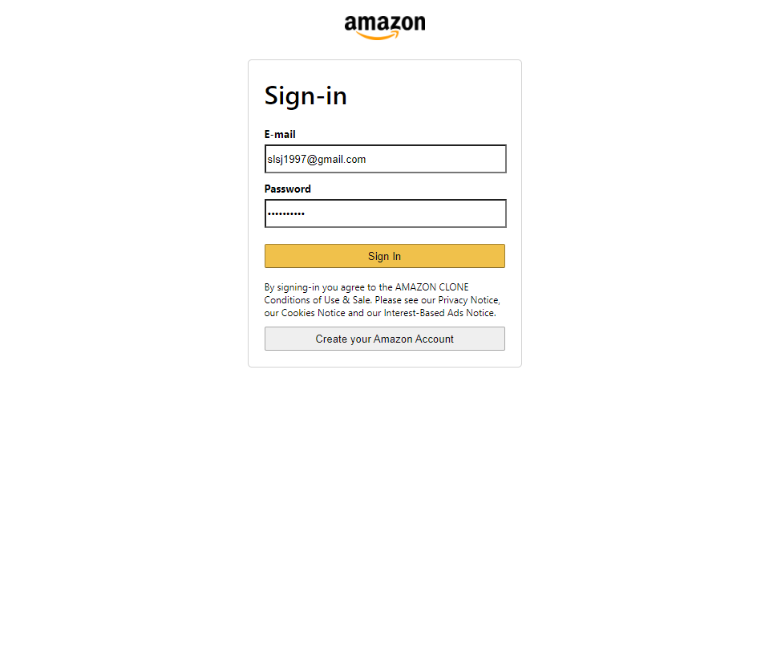
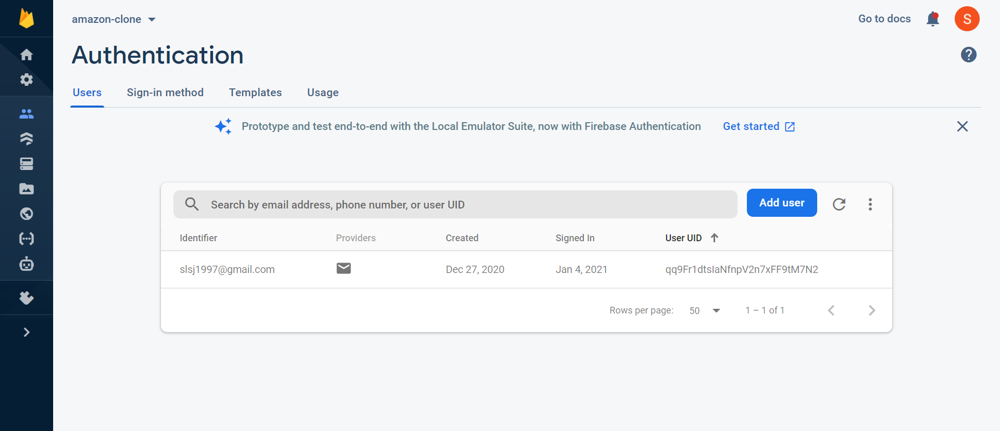

# Project Portfolio
## Project: Amazon Clone
[Amazon Clone](https://clone-124e6.web.app/) is a web application developed using React, with a Google Firebase back-end. This project was developed throughout the winter break in my third year of studies as a computer science undergraduate.

The purpose of this project is to explore full-stack web development, which we are not exposed to during the course of our studies.


You may access the web app [here](https://clone-124e6.web.app/).

Source code can be found [here](https://github.com/shawnlsj97/Amazon-Clone).

## Features Added
### 1. User Authentication
When users first visit Amazon Clone, they can sign up / in via the "Sign In" button on the header. After signing up / in, the header will be updated to reflect that the user is signed in.




User authentication is handled using Firebase.

### 2. Adding Items to Shopping Basket

### 3. Checking Out Items

### 4. Making Payment via Stripe

### 5. Viewing Order History


[Link](url) and 
```
